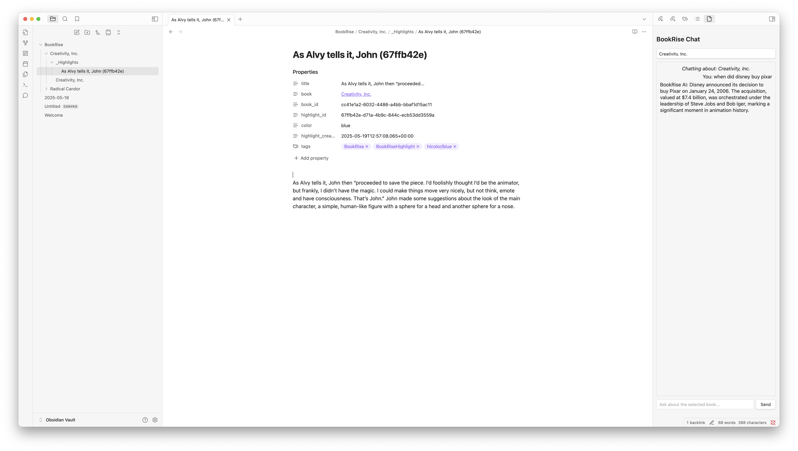

# BookRise Obsidian Plugin

A powerful Obsidian plugin that seamlessly integrates your BookRise library with Obsidian, enabling you to sync your book highlights and chat with your books using AI.

## Features

### 📚 Highlight Sync
- Automatically sync your BookRise highlights into Obsidian
- Choose between two sync modes:
  - **Single File Mode**: All highlights for a book in one file
  - **Individual Notes Mode**: One note per highlight for better organization
- Highlights include metadata like:
  - Page numbers
  - Location references
  - Highlight colors (as tags)
  - Creation timestamps
  - Your personal notes

### 💬 AI Chat Interface
- Chat with your books using BookRise's AI
- Select any book from your library to start a conversation
- Get AI-powered insights about your books
- View chat history in a dedicated sidebar

## Installation

1. Open Obsidian Settings
2. Go to Community Plugins
3. Search for "BookRise"
4. Click Install
5. Enable the plugin

## Configuration

1. Open Obsidian Settings
2. Go to BookRise Settings
3. Enter your BookRise API Key
4. (Optional) Configure the default folder for synced highlights
5. (Optional) Choose your preferred highlight sync mode

### Settings Options

- **BookRise API Key**: Your personal API key from BookRise
- **Sync Folder**: The folder where BookRise notes will be saved (default: "BookRise")
- **Create individual note per highlight**: Toggle between single file and individual notes mode

## Usage

### Syncing Highlights

1. Click the BookRise icon in the left ribbon
2. Or use the command palette: "Sync BookRise Highlights"
3. Wait for the sync to complete
4. Your highlights will appear in the configured folder

### Using the Chat Interface

1. Click the chat icon in the left ribbon
2. Select a book from the dropdown menu
3. Type your question about the book
4. Press Enter or click Send to get AI-powered insights

## Highlight Organization

### Single File Mode
- Creates one file per book
- All highlights are listed in chronological order
- Includes book metadata in YAML frontmatter
- Easy to view all highlights at once

### Individual Notes Mode
- Creates a separate note for each highlight
- Organizes highlights in a `_Highlights` subfolder
- Links highlights back to the main book note
- Better for graph view and individual highlight management

## Tags and Metadata

The plugin automatically adds useful tags and metadata:
- `#BookRise` - Identifies all synced content
- `#BookRiseHighlight` - Tags individual highlight notes
- `#hlcolor/{color}` - Color-based tags for filtering highlights
- `#author/{author_name}` - Author tags for easy filtering

## Support

For support, feature requests, or bug reports:
- Visit [BookRise.io](https://bookrise.io)
- Open an issue on GitHub
- Contact support@bookrise.io

## License

This plugin is licensed under the MIT License.

## Author

Created by [Danny Ruchtie](https://bookrise.io) 